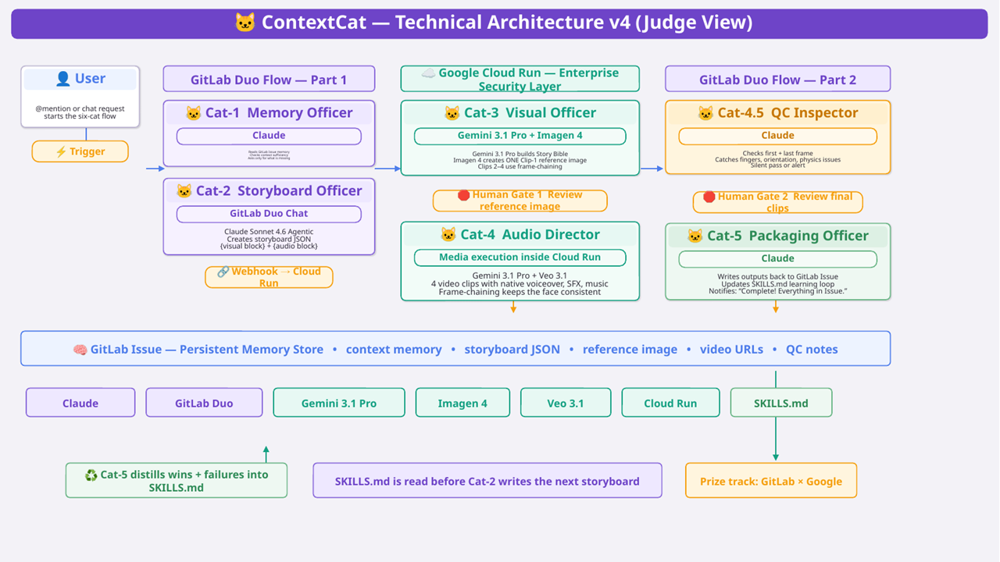
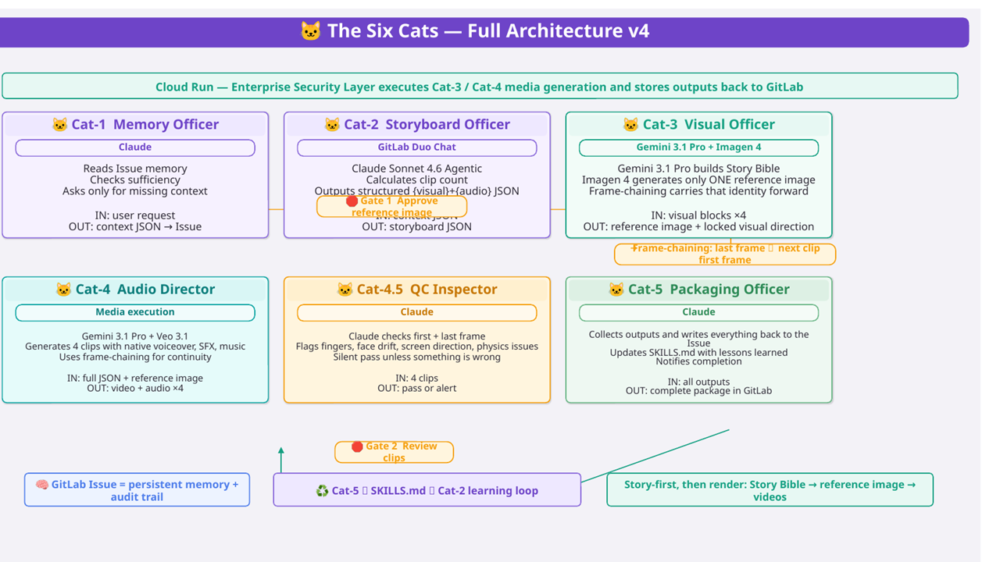
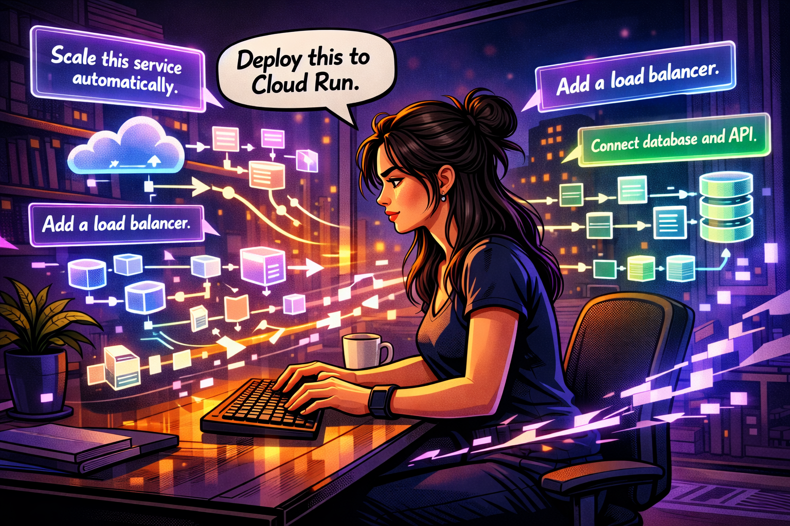
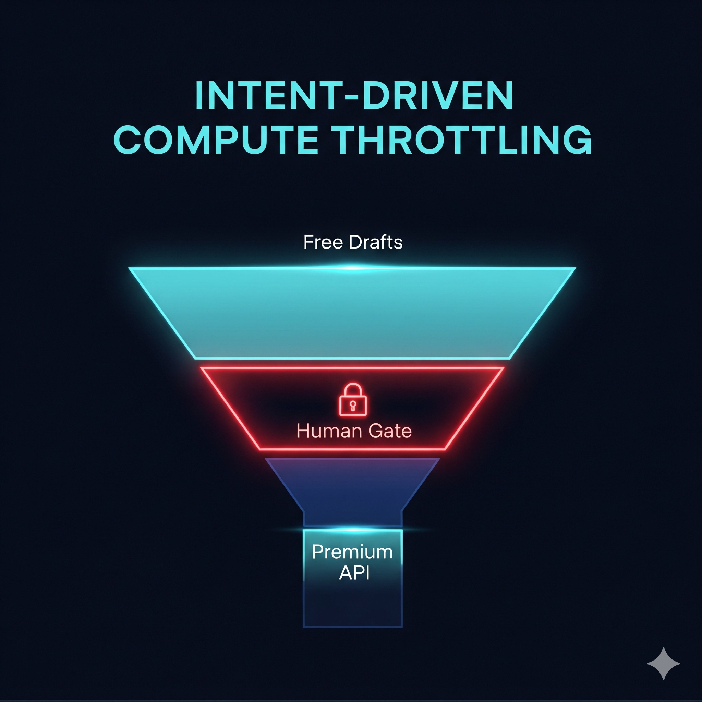

# 🐱 ContextCat
### AI Memory & Multi-Agent Orchestration for GitLab Duo

**GitLab AI Hackathon 2026** | Built by Chloe Kao × Claude (Anthropic) × Gemini 3.1 Pro (Google)

> **One mention. Six cats. Complete AI video package in 18 minutes.**

---

[](https://about.gitlab.com/gitlab-duo/agent-platform/)
[](https://cloud.google.com)
&nbsp;&nbsp;

[-6B46C1?style=for-the-badge)](https://www.anthropic.com/claude)
[](LICENSE)

---

## Architecture





---

## The Problem

Traditional AI video production requires 24–48 hours of manual work across isolated tools:
- 🧠 **AI Amnesia** — Every new chat window means starting from zero
- 🔗 **Human Relay** — Manually copying outputs between AI tools
- ⏱️ **Serial Queue** — Tasks run one by one, no coordination

Research confirms: a 2025 text-to-video benchmark found **80%+ of AI-generated clips require rework**, averaging 2.67 issues per clip. Trial and error is the default workflow.

---

## The Solution

ContextCat is a **GitLab Duo Agent Flow** that acts as a persistent memory layer and multi-agent orchestrator for AI video production.

```
You type: "@contextcat make a 30-second Veo 3.1 video for MoodBloom"

↓ Cat-1 reads stored memory from GitLab Issue (zero re-explaining)
↓ Cat-2 calculates 4 clips, generates structured JSON storyboard
↓ Cat-3 builds Story Bible → Imagen 4 generates Clip 1 reference image
🛑 Gate 1: Review reference image (free — confirm before Veo spend)
↓ Cat-4 calls Veo 3.1 → video + voiceover + SFX + music × 4 clips
↓ Cat-4.5 auto-inspects first/last frame of each clip
🛑 Gate 2: Review clips before packaging
↓ Cat-5 packages everything → GitLab Issue updated → SKILLS.md updated

Result: 18 minutes · 1 sentence · complete video package
```

---

## The Six Cats

| Cat | Role | Powered by |
|-----|------|-----------|
| 🐱 Cat-1 | Memory Officer | Claude (Anthropic) |
| 🐱 Cat-2 | Storyboard Officer | Claude Sonnet 4.6 Agentic (GitLab Duo Chat) |
| 🐱 Cat-3 | Visual Officer | Gemini 3.1 Pro + Imagen 4 |
| 🐱 Cat-4 | Audio Director | Gemini 3.1 Pro + Veo 3.1 |
| 🐱 Cat-4.5 | QC Inspector | Claude (Anthropic) |
| 🐱 Cat-5 | Packaging Officer | Claude (Anthropic) |

---

## Key Design Decisions


**Story Bible → Frame-chaining**
Cat-3 builds a unified Story Bible (character, palette, lighting) before any generation. Frame-chaining passes the last frame of each clip as the first frame of the next — four clips, one continuous world.

**GitLab Issue as memory store**
All context, storyboard JSON, reference images, video URLs, and QC reports are stored as Issue comments. No external database. Memory lives where the work lives.
The GitLab Issue functions as the system's control plane — all orchestration is visible, debuggable, and recoverable 
inside GitLab itself.

**Two Human Gates**

Gate 1 sits between free (Imagen 4) and expensive (Veo 3.1) generation. Gate 2 sits before final packaging. Human judgment at every significant cost boundary.

**SKILLS.md Learning Loop**
Cat-5 updates SKILLS.md after every run. Cat-2 reads it before the next storyboard. The system gets smarter with every execution.

---

## Live Demo

**Issue #9 — Full end-to-end run (18 minutes, zero errors):**
👉 https://gitlab.com/chloe-kao/contextcat/-/work_items/9

4 clips × 8 seconds = 32 seconds | Veo 3.1 | Native audio | Frame-chained

---

## Tech Stack

| Layer | Technology |
|-------|-----------|
| Agent Platform | GitLab Duo Agent Platform (Flow, Tools, Triggers, Context) |
| AI — Memory & QC | Claude (Anthropic) |
| AI — Storyboard | Claude Sonnet 4.6 Agentic (GitLab Duo Chat) |
| AI — Story Bible | Gemini 3.1 Pro (Vertex AI) |
| AI — Image | Imagen 4 (Vertex AI) |
| AI — Video + Audio | Veo 3.1 (Vertex AI) |
| Execution Bridge | Google Cloud Run (Python/Flask) |
| Storage | Google Cloud Storage |
| Memory Store | GitLab Issues |

---

## Repository Structure

```
contextcat/
├── flows/
│   ├── contextcat_part1.yaml    # Cat-1 + Cat-2 (Memory + Storyboard)
│   └── contextcat_part2.yaml   # Cat-3~5 (Visual + Audio + QC + Package)
├── agents/
│   └── agent-config.yml        # GitLab Duo Agent configuration
├── examples/
│   └── sample_storyboard_output.json  # Real output from Issue #9
├── main.py                     # Cloud Run service (Python/Flask)
├── Dockerfile                  # Container configuration
├── requirements.txt            # Python dependencies
├── SKILLS.md                   # Learning loop document
├── AGENTS.md                   # Agent descriptions
└── .env.example                # Environment variables template
```

---

## Setup

### Prerequisites
- GitLab account with Duo Agent Platform access
- Google Cloud project with Vertex AI enabled
- Cloud Run deployed (see deployment below)

### Environment Variables
```bash
cp .env.example .env
# Fill in your values
```

Required variables:
```
GITLAB_TOKEN=your_gitlab_token
GITLAB_URL=https://gitlab.com
GCP_PROJECT_ID=your_gcp_project_id
GCP_LOCATION=us-central1
WEBHOOK_SECRET=your_webhook_secret
```

### Deploy to Cloud Run
```bash
gcloud run deploy contextcat-media \
  --source . \
  --region us-central1 \
  --allow-unauthenticated
```

### Configure GitLab Webhook
1. Go to your GitLab Project → Settings → Webhooks
2. URL: `https://your-cloud-run-url/webhook`
3. Trigger: **Comments**
4. Secret token: your `WEBHOOK_SECRET`

### Activate the Flow
1. Import `flows/contextcat_part1.yaml` and `flows/contextcat_part2.yaml` into GitLab Duo Agent Platform
2. Create a GitLab Issue with your project context
3. Mention `@contextcat` to start
**Note:** Cat-2 (Storyboard Officer) operates via GitLab Duo Chat 
with Claude Sonnet 4.6 Agentic. Ask it to read your Issue and 
generate a storyboard JSON before triggering the pipeline.

---

## Trigger Phrases

| Phrase | Action |
|--------|--------|
| `contextcat generate media` | Part 1: Story Bible + Imagen 4 + Gate 1 |
| `approved, generate videos` | Part 2: Veo 3.1 × 4 clips + Delivery |

---

## Prize Tracks

🏆 Grand Prize | 🤝 GitLab × Anthropic | 🌐 GitLab × Google | ♻️ Green Agent Prize

---

## License

MIT — see [LICENSE](LICENSE)

---

*Generated with ContextCat × Claude (Anthropic) × Gemini 3.1 Pro × Imagen 4 × Veo 3.1 × Google Cloud Run*
